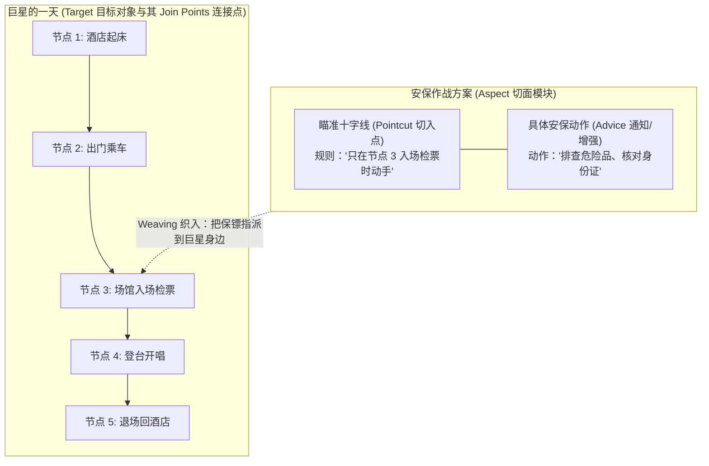

# 一文搞懂 AOP 核心术语：切面、切点、连接点、Target 到底是啥？

> **一句话直击痛点**：  
> 为什么初学者觉得 AOP 专有名词难懂？因为传统教材把它们翻译成了极具几何数学色彩的词汇（“切面”、“切点”、“织入”）。  
> 本文用一个**“巨星演唱会与专职安保团队”**的生活故事，让你彻底建立起画面感心智模型，终身不忘！

---

## 1. 宏观全景：巨星行程与安保作战图 (Macro-First)

想象一下顶级巨星开演唱会的全天行程与安保团队的布防方案，AOP 的所有抽象概念都能在其中找到一一对应的实体：



---

## 2. 六大核心专有名词逐一解密

### ① Target（目标对象）—— 核心业务主角
* **生活对应**：**巨星周杰伦本人**。
* **概念本质**：**“被代理、被保护的核心业务主角是谁？”**
  - 周杰伦唯一的专业任务是把歌唱好（核心业务逻辑，比如算钱、下单、扣减库存）；
  - 他绝对不需要自己扛着金属探测仪去安检歌迷，也不需要自己去核对假币；
  - 他是完全纯净的，不掺杂任何安保逻辑。
* **代码对应**：纯净的 [`OrderService`](file:///Users/linya/Code/Self/Javascript/aop/src/services/order.service.ts) 或 [`UserService`](file:///Users/linya/Code/Self/Javascript/aop/src/services/user.service.ts) 类。

---

### ② Join Point（连接点）—— 所有“候选”的时空路口
* **生活对应**：周杰伦这一天行程里的**每一个时间节点**（起床、乘车、进场、开唱、退场）。
  - 理论上，安保团队在任何一个节点都可以插手；
  - 所有的节点，都具备被拦截的“潜力”。
* **概念本质**：**“程序执行过程中，所有可能插入切面的候选时机点。”**
* **代码对应**：在 Java / TypeScript 中，连接点通常指**类中所有方法的调用时机**（比如 `createOrder` 调用前、`payOrder` 调用后、方法抛出异常时）。如果你的系统里有 100 个方法，那就存在成百上千个连接点。

---

### ③ Pointcut（切点 / 切入点）—— 瞄准镜的十字线
* **生活对应**：安保主管下达的**精准布控规则**：
  > *“周杰伦一天有无数节点（Join Point），但我们【只在‘节点 3：场馆入场检票’】这个特定路口动手！他上厕所睡觉别去打扰。”*
* **概念本质**：**“从成千上万个候选连接点中，用一条规则把真正要拦截的点筛选出来的断言表达式。”**
* **代码对应**：
  - 表达式规则：Spring 中的 `@Pointcut("execution(* com.service.*.*(..))")`；
  - 动态代理匹配器：本项目 [`proxy-factory.ts`](file:///Users/linya/Code/Self/Javascript/aop/src/core/proxy-factory.ts) 中的 `pointcut: (methodName) => methodName.startsWith('create')`；
  - 注解标记：比如只拦截打了 `@Transactional` 标签的方法。

---

### ④ Advice（通知 / 增强）—— 在指定点上“具体干什么”
* **生活对应**：保镖在检票口切入后，执行的**具体工作内容**：
  - “拿金属探测仪搜身、收缴易燃易爆物、查看门票防伪码”。
* **概念本质**：**“切面在特定连接点触发时，实际执行的代码逻辑。”**
* **代码对应**：
  - 打印出入参日志（[`LoggingAspect`](file:///Users/linya/Code/Self/Javascript/aop/src/aspects/logging.aspect.ts)）；
  - 开启数据库事务、回滚事务（[`TransactionAspect`](file:///Users/linya/Code/Self/Javascript/aop/src/aspects/transaction.aspect.ts)）；
  - 权限角色校验（[`AuthAspect`](file:///Users/linya/Code/Self/Javascript/aop/src/aspects/auth.aspect.ts)）。

---

### ⑤ Aspect（切面）—— 整套安保作战方案
* **生活对应**：安保公司拿出的那本完整的**《场馆防暴安保作战方案》**。
  - 这本方案里既写了“在哪个门布控（Pointcut）”，又写了“保镖该做什么动作（Advice）”。
  - 它是一份完整的独立模块。
* **概念本质**：**“切点 (Pointcut) + 通知 (Advice) 打包组合而成的独立模块。”**
* **代码对应**：一个切面类或切面对象（比如定义了切入点和通知函数的 `Aspect` 接口实现）。

---

### ⑥ Weaving（织入）—— 把保镖安插到巨星身边的“装配过程”
* **生活对应**：安保公司把保镖实际派驻到周杰伦身边，形成**“巨星 + 保镖同行”**的动作过程。
* **概念本质**：**“一个动词：将切面代码与目标对象融合、创建最终代理对象的技术手段与过程。”**
* **代码对应**：
  - **编译期/定义期织入**：使用 `@Around` 装饰器替换方法属性描述符；
  - **运行期动态代理织入**：调用 `AopProxyFactory.create(target, [aspects])` 用 Proxy 包裹原对象。

---

## 3. 数学公理级推导：AOP 的终极恒等式

在软件架构设计中，我们可以用两个数学公式严密表示这几者的结构关系：

$$\text{Aspect (切面)} = \text{Pointcut (切入点)} + \text{Advice (具体通知动作)}$$

> **大白话**：切面就是搞清楚两件事——**“在什么地方动手（Pointcut）”** 加上 **“动手干什么（Advice）”**！

$$\text{Proxy (最终代理对象)} = \text{Weaving (织入动作)} \Big( \text{Target (纯净目标)}, \text{Aspect (切面方案)} \Big)$$

> **大白话**：通过织入过程（Weaving），把切面方案（Aspect）挂到纯净业务对象（Target）身上，最终诞生出一个具备全套保驾护航能力的代理对象（Proxy）！

---

## 4. 极简速记口诀与速查矩阵

```text
┌─────────────────────────────────────────────────────────────┐
│                       AOP 极简速记口诀                       │
├─────────────┬───────────────────────────────────────────────┤
│ Target      │ 【谁】是核心业务主角？ (纯净业务类)            │
│ Join Point  │ 【哪些地方可以】插手？ (所有方法调用的时机点)  │
│ Pointcut    │ 【确定在哪个点】动手？ (瞄准表达式/筛选规则)   │
│ Advice      │ 【具体做什么】动作？ (日志/事务/重试等横切逻辑)│
│ Aspect      │ 【切点 + 动作】的完整打包 (整个切面模块)       │
│ Weaving     │ 把切面装配到对象上的【过程动作】 (装饰器/代理) │
└─────────────┴───────────────────────────────────────────────┘
```

---

## 5. 本仓库真实代码 1:1 对号入座

在本项目代码库中，每一项概念都有具象代码支撑：

| AOP 概念 | 代码中的具象实体 | 源码文件链接 |
| :--- | :--- | :--- |
| **Target** | `OrderService`, `UserService` | [`order.service.ts`](file:///Users/linya/Code/Self/Javascript/aop/src/services/order.service.ts) |
| **Join Point** | `createOrder()`, `payOrder()` 执行时机 | 每一个业务方法的调用生命周期 |
| **Pointcut** | `aspect.pointcut(methodName)` 或装饰器绑定 | [`proxy-factory.ts`](file:///Users/linya/Code/Self/Javascript/aop/src/core/proxy-factory.ts#L40) |
| **Advice** | `logAroundAdvice`, `transactionalAdvice` | [`logging.aspect.ts`](file:///Users/linya/Code/Self/Javascript/aop/src/aspects/logging.aspect.ts) |
| **Aspect** | `LoggingAspect`, `TransactionAspect` | [`types.ts`](file:///Users/linya/Code/Self/Javascript/aop/src/core/types.ts#L100) |
| **Weaving** | `@Around(advice)` 与 `AopProxyFactory.create()` | [`decorators.ts`](file:///Users/linya/Code/Self/Javascript/aop/src/core/decorators.ts) |
