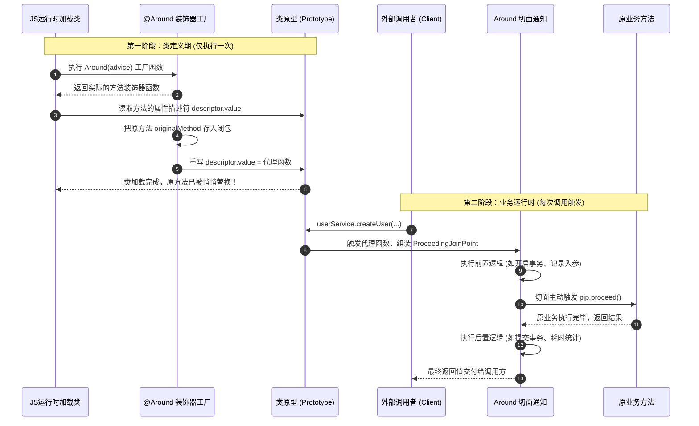

# 深度剖析 @Around：底层基于什么 TS/JS 语法实现？

> **一句话拆解核心**：  
> `@Around` 并不是编译器内置的特殊黑魔法，而是**高阶函数（工厂）+ 实验性方法装饰器规范 + 原生属性描述符 (PropertyDescriptor) 劫持 + 闭包变量捕获 + 显式 this 绑定 + 严格泛型推导**的“六合一”组合拳。

---

## 1. 宏观全景：@Around 的运行生命周期

很多人以为切面是在调用方法时才临时挂上去的。其实，`@Around` 的工作被严格划分为**两个完全不同的生命周期阶段**：



---

## 2. 源码逐行解密：5 大核心 TS/JS 语法体系

结合项目中 [`aop/src/core/decorators.ts`](file:///Users/linya/Code/Self/Javascript/aop/src/core/decorators.ts) 的完整实现，我们将每一行代码还原为对应的底层语言机制：

```typescript
export function Around<
  TTarget extends object,
  TArgs extends unknown[],
  TReturn
>(
  advice: AroundAdvice<TTarget, TArgs, TReturn>
): MethodDecorator {
  return function (
    _target: object,
    propertyKey: string | symbol,
    descriptor: PropertyDescriptor
  ): PropertyDescriptor {
    // 语法 2 & 3: 提取原函数并存入闭包
    const originalMethod = descriptor.value as (
      this: TTarget,
      ...args: TArgs
    ) => Promise<TReturn> | TReturn;

    const methodName = String(propertyKey);

    // 语法 2 & 4: 重写方法属性描述符的值，注入显式 this
    descriptor.value = function (
      this: TTarget,
      ...args: TArgs
    ): Promise<TReturn> | TReturn {
      // 语法 3: 构造含有 proceed 句柄的 ProceedingJoinPoint
      const pjp: ProceedingJoinPoint<TTarget, TArgs, TReturn> = {
        target: this,
        methodName,
        args,
        proceed: (overrideArgs?: TArgs): Promise<TReturn> | TReturn => {
          const finalArgs = overrideArgs !== undefined ? overrideArgs : args;
          return originalMethod.apply(this, finalArgs);
        },
      };

      // 将控制权全权移交给切面通知
      return advice(pjp);
    };

    return descriptor;
  };
}
```

---

### 语法 1：装饰器工厂与高阶函数 (Decorator Factory & HOF)

#### 表现形式：
为什么我们在类里写的是 `@Around(logAroundAdvice)` 而不是 `@Around`？
因为我们需要向切面传递参数（即具体的通知函数 `advice`）。

#### 语言机制：
- 外层函数 `Around(advice)` 接收切面函数，这是**高阶函数（Higher-Order Function）**；
- 它返回的内层匿名函数 `function (_target, propertyKey, descriptor)` 才是真正符合 TypeScript `MethodDecorator` 签名的装饰器实体；
- 这种“外层传参、内层装饰”的标准模式在 TypeScript 规范中被称为**装饰器工厂 (Decorator Factory)**。

---

### 语法 2：方法属性描述符劫持 (PropertyDescriptor)

#### 表现形式：
```typescript
const originalMethod = descriptor.value;
descriptor.value = function (this: TTarget, ...args) { ... };
return descriptor;
```

#### 语言机制：
这是源自 ECMAScript 5 (ES5) 的底层元编程机制，即 `Object.getOwnPropertyDescriptor` 与 `Object.defineProperty`：
- 在 JavaScript 类（Class）中，所有实例方法实际上挂载在类的原型对象（`ClassName.prototype`）上；
- 原型上的每个属性都有一个**属性描述符对象 (Property Descriptor)**，它包含：
  - `value`: 当前属性存储的实际值（在方法中，它就是一个 `Function` 对象）；
  - `writable`: 是否可写；
  - `enumerable`: 是否可枚举；
  - `configurable`: 是否可配置。
- **劫持的核心动作**：装饰器直接修改了 `descriptor.value`，把原本指向原方法的指针，替换为了一个全新包装的函数！最后将修改后的 `descriptor` 返回，TypeScript 运行时便会调用 `Object.defineProperty` 完成热替换。

---

### 语法 3：闭包与词法作用域 (Closure & Lexical Scope)

#### 表现形式：
原方法明明被 `descriptor.value = ...` 覆盖掉了，为什么调用 `pjp.proceed()` 时还能正确执行原逻辑？

#### 语言机制：
这就是 JavaScript 经典的**闭包机制**：
- 在类加载阶段，`const originalMethod = descriptor.value;` 保存了一个对原函数的引用；
- 新赋予的包装函数持有了外层作用域的变量环境（Lexical Environment）；
- 即使装饰器工厂已经执行结束并返回，被替换后的函数依然在内存闭包中死死抓着 `originalMethod`；
- 外部哪怕疯狂调用 `userService.createUser()`，闭包里的 `originalMethod` 永远安全驻留，随时等待通过 `originalMethod.apply(this, finalArgs)` 被再次唤醒。

---

### 语法 4：显式 `this` 伪参数与 `Function.prototype.apply`

#### 表现形式：
```typescript
descriptor.value = function (this: TTarget, ...args: TArgs) {
  // ...
  return originalMethod.apply(this, finalArgs);
}
```

#### 语言机制：
这是保证**面向对象实例状态不丢失**的最关键语法：
1. **TypeScript 显式 `this` 语法**：
   在函数参数列表的第一位写 `this: TTarget` 是 TypeScript 专属的语法糖。在编译成 JavaScript 后这行参数会被**完全擦除**；它的唯一作用是让 TypeScript 类型检查器知道：“**当这个函数被调用时，它的执行上下文 `this` 必须是 `TTarget` 类的实例！**” 从而防止在方法内部调用 `this.users.set()` 时报错。
2. **`originalMethod.apply(this, finalArgs)`**：
   调用原方法时，绝不能写 `originalMethod(...finalArgs)`，因为那样会导致原方法内部的 `this` 变为 `undefined` 或全局对象，从而丢失整个类的属性上下文。使用 `.apply(this, ...)` 能够把当前被代理实例的上下文原封不动地还给原业务方法。

---

### 语法 5：严格泛型守卫 (Generics & Type Safety)

#### 表现形式：
```typescript
<TTarget extends object, TArgs extends unknown[], TReturn>
```

#### 语言机制：
为了遵循工程红线中的**极严类型守卫、零 `as any`**：
- `TTarget extends object`：约束被装饰的必须是对象方法，不能给基础类型装饰；
- `TArgs extends unknown[]`：捕获目标方法的参数元组类型；
- `TReturn`：捕获目标方法的返回值类型；
- 借助这一套泛型，无论目标方法是 `async (id: string, name: string) => Promise<User>` 还是 `(id: string) => boolean`，TypeScript 编译器都会在编码期进行双向推导，一旦切面篡改了不兼容的返回值类型，编译器将当场报错。

---

## 3. 费曼小学生生活类比：汽车与“钥匙代管盒”

如果向一个完全不懂编程的小学生解释 `@Around` 的底层代码过程：

1. **普通的汽车（原业务方法）**：
   车子本身只会往前开（专注纯业务）。但是你开车必须先系安全带、交过桥费、如果撞车了叫拖车。
2. **加装代管盒（@Around 装饰器）**：
   在工厂造车下线时（类加载期），工程师把原本插在车上的点火钥匙拔了下来，放进了一个**智能密码盒（闭包）**里；
   并给车子换上了一个假按钮（替换后的 `descriptor.value`）。
3. **当司机按下按钮时（方法调用运行时）**：
   车子并没有直接打火，而是由**代驾安全员（切面通知 Advice）**接管了控制台：
   - 安全员先检查你有没有喝酒（**前置逻辑**）；
   - 如果一切合格，安全员按下密码盒里的真钥匙（**执行 `pjp.proceed()`**），汽车轰鸣启动！
   - 车跑完之后，安全员帮你擦洗车身并汇报油耗（**后置逻辑**）；
   - 万一发动机半路冒烟，安全员立刻帮你断电灭火（**异常处理与回滚**）。
4. **结论**：
   汽车从始至终只管自己开，它甚至不知道自己的点火权已经被密码盒和安全员全程包裹了。

---

## 4. 揭秘底层：TypeScript 编译后的 JavaScript 到底长什么样？

很多人好奇：我们写在 TS 里的 `@Around(logAroundAdvice)`，被 `tsc` 编译后在 JavaScript 里到底变成了什么？

如果你打开编译后的 `dist/services/user.service.js`，你会看到类似这样的代码：

```javascript
// tsc 自动生成的装饰器执行辅助函数
var __decorate = (this && this.__decorate) || function (decorators, target, key, desc) {
    var c = arguments.length, r = c < 3 ? target : desc === null ? desc = Object.getOwnPropertyDescriptor(target, key) : desc, d;
    for (var i = decorators.length - 1; i >= 0; i--) {
        if (d = decorators[i]) {
            r = (c < 3 ? d(r) : c > 3 ? d(target, key, r) : d(target, key)) || r;
        }
    }
    return c > 3 && r && Object.defineProperty(target, key, r), r;
};

// 编译后的类定义
class UserService {
    async getUserById(id) {
        return this.users.get(id);
    }
}

// ⭐⭐⭐ 在类定义完毕后，tsc 自动执行了这行元编程调用：
__decorate([
    Around(logAroundAdvice),
    Around(measurePerformanceAdvice)
], UserService.prototype, "getUserById", null);
```

### 底层事实一目了然：
1. JavaScript 引擎并不原生识别 `@` 这个符号；
2. TypeScript 编译器在编译阶段，**把 `@Around` 转换成了一个普普通通的函数调用 `__decorate(...)`**；
3. `__decorate` 做的事情极其朴素：从右向左依次取出你的装饰器，把 `UserService.prototype` 和 `"getUserById"` 的属性描述符传给它，由装饰器修改完成后，重新调用 `Object.defineProperty(...)` 写回原型！

---

## 5. 对比 Spring Boot：TypeScript vs Java AOP 实现底座

| 维度 | Java Spring Boot AOP | TypeScript @Around |
| :--- | :--- | :--- |
| **执行时机** | 运行期通过动态代理或编译期/加载期 AspectJ 字节码织入 | 类文件被 Node/浏览器加载执行时（定义期即完成原型劫持） |
| **修改对象** | 生成一个全新的子类（CGLIB）或代理接口实现类（JDK Proxy） | 直接重写类原型对象上的 `PropertyDescriptor.value` |
| **控制权交付** | `ProceedingJoinPoint.proceed()` | `ProceedingJoinPoint.proceed()`（内部借由 `originalMethod.apply`） |
| **类型保障** | Java 编译器与泛型边界 | TypeScript 高级泛型约束，编译后类型擦除 |
| **运行时依赖** | 依赖 JVM 反射（Reflection）与 ASM / CGLIB 字节码工具库 | **零额外运行时依赖**，纯原生 JavaScript 对象属性操作与闭包 |

---

## 6. 总结脑图

```text
@Around(advice)
  ├── 1. 装饰器工厂 (HOF) ─────── 接收外部 advice，返回实际装饰器
  ├── 2. 属性描述符 (Descriptor) ── 从原型获取 descriptor.value 并重写
  ├── 3. 闭包 (Closure) ───────── 把原方法 originalMethod 锁在内存环境
  ├── 4. 显式 this 伪参数 ─────── 保证编译期与运行时对象上下文不丢失
  ├── 5. 严格泛型系统 ────────── 保留入参与返回值的强类型推导
  └── 6. ProceedingJoinPoint ──── 把调用控制权作为参数转交切面驱动
```
