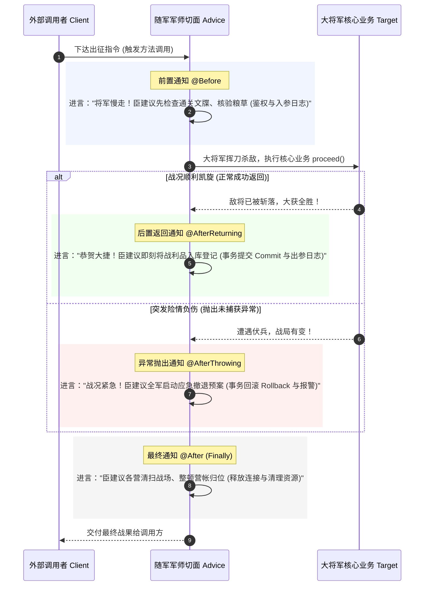

# 深入理解 Advice：为什么 AOP 里的“通知/增强”在英文里叫“建议”？

> **一句话解密**：  
> `Advice` 在英文里不仅是“建议”，它源自 1966 年 Lisp 语言给函数**“在旁指点（Advise）”**的学术传统，也是商业与法律中代表严肃指令的**“照会通知单（Letter of Advice）”**。  
> 它是大将军（业务方法）身旁常驻的**首席军师（Advisor）**：在出征前、凯旋后或战败时，适时递上的一条条**锦囊妙计与配套行动（Advice）**。

---

## 1. 宏观时序全景：大将军出征与随军军师

很多初学者容易把 AOP 的各个通知类型搞混。如果我们把业务方法想象成冲锋陷阵的**大将军**，把切面想象成随军的**参谋军师**，整个时序流立刻一目了然：



- **大将军 (Target Method)**：只专注攻城拔寨，不被任何杂事分心；
- **军师进言 (Advice)**：全方位保驾护航，在关键时机自动触发。

---

## 2. 计算机科学史溯源：这个词从何而来？

AOP（面向切面编程）并不是 2000 年后 Java 或 Spring 团队凭空生造的术语，它的源头可以一直追溯到 **1966 年麻省理工学院（MIT）的 Lisp 系统**：

### ① 1966 年 Warren Teitelman 的开创性发明
在 1960 年代，MIT 著名计算机科学家 **Warren Teitelman** 在设计 Lisp 开发环境时遇到了一个普遍难题：
> *程序员写好了一个纯净的核心函数 `(defun compute-tax ...)`。当需要调试、测量性能或打印中间变量时，开发者不得不把源码改得面目全非，测试完再痛苦地删掉。*

为了解决这个问题，Teitelman 提出了一种划时代的调试机制，命令就叫 **`advise`**：
```lisp
;; 在不改动 compute-tax 源代码的前提下，给它“进言”
(advise compute-tax :before '(print-arguments))
(advise compute-tax :after '(measure-runtime))
```
- 这里的英文动词 `advise`，意思是 **“给……进言 / 附带指导指令”**；
- 它的哲学是：**原函数不知道有顾问的存在，但顾问可以在原函数周围施加影响。**

### ② 1990 年代施乐帕洛阿尔托实验室 (Xerox PARC) 的继承
1997 年，施乐 PARC 的 **Gregor Kiczales** 团队在正式确立 AOP 理论并开发 **AspectJ** 时，作为向 Lisp 先辈的崇高致敬，完整沿用了这套经典词汇：
- **Pointcut**：在何处切入；
- **Join Point**：连接点；
- **Advice**：在切入点执行的具体辅助/增强逻辑。

---

## 3. 词源学与商业英语：为什么中文翻译为“通知”和“增强”？

日常生活中，我们熟悉的是 `Advice` 作为不可数名词表示“劝告、建议”。但在英美专业语境和词源演变中，它有着更为严肃的分支含义：

### ① 商业与金融中的法律效力：照会公函 (Notification)
在国际贸易和金融结算中，`Advice` 从来不是“口头建议”，而是具有法律效力的**正式通知单**：
- **Remittance Advice**：银行汇款**通知单 / 确认凭单**（绝非“汇款建议”）；
- **Advice of Dispatch**：海关发货**照会通知公函**；
- **Letter of Advice**：提货通知书。

在古法语和中世纪英语词源中，*advys / avis* 意为 **“正式告知、知会、裁决意见”**。

### ② 中文软件工程先辈的两大绝妙译法
当年国内计算机学者在翻译 Spring Boot / AspectJ 规范时，如果机械翻译成“建议”，开发者会非常困惑：“事务回滚明明是强制执行的，凭什么叫建议？”

因此，先辈们给出了两个极其精彩的意译：
1. **意译为“通知 (Advice)”**：
   - 侧重于**时机与事件触发 (Event Driven)**：当目标业务执行到特定连接点时，AOP 框架向切面发出“事件通知”，切面随即介入；
2. **业内俗称为“增强 (Enhancement / Interceptor)”**：
   - 侧重于**功能结果**：原本赤手空拳的纯净业务方法，在切面的协助下，被武装上了日志、事务、鉴权等更强大的超能力！

---

## 4. 五大 Advice 在代码与故事中的 1:1 映射

在 TypeScript / Spring Boot 中，五大 Advice 正好对应军师出谋划策的五个阶段：

| Advice 术语 | 军师的故事 | 现实中的代码职责 | 源码定位参考 |
| :--- | :--- | :--- | :--- |
| **`@Before`**<br>(前置通知) | *“将军慢走，臣建议先验关卡令箭！”* | 方法执行前拦截：参数有效性校验、TraceID 注入、RBAC 角色鉴权 | [`auth.aspect.ts`](file:///Users/linya/Code/Self/Javascript/aop/src/aspects/auth.aspect.ts) |
| **`@AfterReturning`**<br>(后置返回通知) | *“恭贺大捷，臣建议将战果登记入库！”* | 方法正常返回后拦截：记录出参日志、提交数据库事务 (`commit`)、更新缓存 | [`decorators.ts`](file:///Users/linya/Code/Self/Javascript/aop/src/core/decorators.ts) |
| **`@AfterThrowing`**<br>(异常通知) | *“突发险情，臣建议启动备用撤退预案！”* | 方法抛出异常时拦截：自动捕获并触发事务回滚 (`rollback`)、报警告警 | [`transaction.aspect.ts`](file:///Users/linya/Code/Self/Javascript/aop/src/aspects/transaction.aspect.ts) |
| **`@After`**<br>(最终通知) | *“鸣金收兵，臣建议打扫战场营帐归位！”* | 无论成败均执行（类似 `finally`）：关闭数据库连接、释放线程锁、清理上下文 | [`decorators.ts`](file:///Users/linya/Code/Self/Javascript/aop/src/core/decorators.ts) |
| **`@Around`**<br>(环绕通知) | *“将军出征全程，由臣全权代管帅印！”* | 权力最大：包围整个方法生命周期，完全掌控 `proceed()` 的调用与参数篡改 | [`logging.aspect.ts`](file:///Users/linya/Code/Self/Javascript/aop/src/aspects/logging.aspect.ts) |

---

## 5. 知识内化与深度自检思考

1. **为什么 Spring AOP 中最常用的不是 `@Before`，而是 `@Around`？**  
   （*思考提示：因为性能计时需要同时记录开始和结束时间；事务控制需要同时包含 commit 和 rollback。只有环绕通知持有完整生命周期和 `ProceedingJoinPoint` 控制权。*）

2. **如果说 Advice 是军师的“一条条计策”，那么 Aspect（切面）是什么？**  
   （*思考提示：Aspect 就是整本**《锦囊妙计合集 / 孙子兵法》**，它把多个相关的 Advice 组织在一个模块或类中，比如 `TransactionAspect` 包含了开启、提交、回滚等整套计策。*）

3. **当多个切面同时作用于同一个方法时，军师进言的顺序是谁说了算？**  
   （*思考提示：在 Spring 中通过 `@Order(1)` 注解排序；在 TypeScript 中通过装饰器的组合顺序或代理链的数组下标决定嵌套层级。*）
