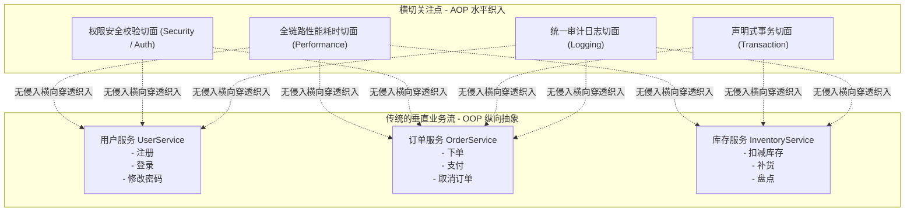

# 什么是 AOP：从第一性原理与生活故事看面向切面编程

> **一句话直击本质**：  
> **面向对象编程 (OOP) 是“纵向”切割业务世界，而面向切面编程 (AOP) 是“横向”抽取通用规律。**  
> AOP 的终极使命是：**让核心业务代码保持 100% 的纯净，在完全不修改业务代码的前提下，从外部无声无息地为其包裹上日志、事务、鉴权、耗时监控等“通用能力机甲”。**

---

## 1. 宏观全景与正交切面骨架 (Macro-First)

在没有 AOP 之前，我们的软件就像一个个独立的垂直业务烟囱；而当通用需求来临时，传统的 OOP 会陷入两难困境：



- **纵向轴（Y 轴）**：专注于**做什么**（What to do），例如下单、扣减库存、计算优惠券，这是系统的业务灵魂。
- **横向轴（X 轴）**：专注于**怎么保护与支撑**（How to support），例如不管你是什么业务，只要开始跑就得记日志、开事务、防超时、验权限。

---

## 2. 费曼小学生生活类比：把抽象变具象

如果你向一个小学生解释 AOP，不要提“动态代理”、“字节码增强”或“反射元数据”，讲下面两个生活中的故事，他立刻就能听懂：

### 故事一：机场安检门 vs 登机口自检
- **没有 AOP 的世界**：
  机场有 50 个登机口（飞北京、飞巴黎、飞纽约）。如果要求“每个登机口的工作人员，自己掏出探测器给旅客搜身、自己检查行李有没有液体、自己记录护照号”，不仅这 50 个登机口的人累得半死，一旦民航局改规则“严禁携带超过 100ml 液体”，机场必须跑到 50 个登机口逐个更新培训手册。
- **有了 AOP 的世界**：
  所有旅客无论去哪个登机口，在进入候机厅之前，**统一通过一道“安检切面大门”**。
  - 安检门只管查违禁品（**前置通知**）；
  - 登机口工作人员只管撕登机牌放行（**核心业务**）；
  - 登机广播在飞机起飞后自动汇报（**后置通知**）。
  安检规则一旦改动，**只需要升级这道安检门，50 个登机口的业务员完全不知情、也不受干扰！**

---

### 故事二：汉堡包模型 (Advice 五大通知)
想象一个巨无霸汉堡包：
- 🍔 **顶层面包**：`@Before`（前置通知，比如检查顾客有没有洗手）；
- 🥩 **中间纯牛肉饼**：**核心业务方法**（纯粹做商品打折、计算金额，里面没有一行多余的日志代码）；
- 🍔 **底层面包**：`@AfterReturning`（后置成功通知，拿到牛肉饼后加生菜、包装打包）；
- 🗑️ **掉在地上进垃圾桶**：`@AfterThrowing`（异常通知，如果肉饼烤糊了抛出异常，立即触发清理回滚）；
- 🌯 **最外层的汉堡保温纸**：`@Around`（环绕通知，全程包裹住整个制作过程，从开工到交付计时）。

---

## 3. 数学公理级的严密推导链：为什么代码没有 AOP 会走向崩溃？

让我们像数学定理证明一样，一步一步推导 AOP 诞生的必然性：

### 【公理 1】：单一职责原则 (SRP)
> 软件工程基本公理：一个模块、类或函数，应该有且仅有一个引起它变化的原因。业务函数应该且仅应该专注于业务逻辑计算。

### 【现象 2】：现实工程中的横切需求爆炸
在真实企业系统中，任何一个方法（比如 `transferMoney` 转账），都必须具备以下“护航能力”：
1. 权限拦截：判断当前登录用户是否有财务权限；
2. 参数审计：把输入参数打上 TraceID 输出到日志；
3. 事务控制：开启数据库事务 `setAutoCommit(false)`；
4. 耗时度量：记录开始时间，超过 50ms 报警；
5. 异常回滚：遇到数据库宕机或扣款失败立即 `rollback`。

### 【推论 3（反证法的灾难）】：用传统 OOP 手写横切逻辑的后果
如果不使用 AOP，我们只能在每个 Service 方法里直接编码：

```typescript
// ❌ 没有 AOP 时的惨状（反面案例：代码泥潭与代码散落）
class OrderService {
  async placeOrder(userId: string, items: Item[]) {
    // 1. 鉴权逻辑 (5行)
    const currentUser = Security.getUser();
    if (!currentUser.hasRole('BUYER')) throw new Error('403');
    
    // 2. 耗时打点 (2行)
    const startTime = performance.now();
    
    // 3. 开启事务 (3行)
    const tx = db.beginTransaction();
    
    try {
      // 4. 出入参日志 (2行)
      logger.info('开始下单', { userId, items });

      // ⭐⭐⭐ 真正有用的核心业务代码只有这 2 行！ ⭐⭐⭐
      const order = await this.repo.createOrder(userId, items);
      await this.inventory.deduct(items);

      // 5. 提交事务 (2行)
      tx.commit();
      
      // 6. 返回成功日志 (2行)
      logger.info('下单成功', order);
      return order;
    } catch (err) {
      // 7. 异常回滚 (3行)
      tx.rollback();
      logger.error('下单失败回滚', err);
      throw err;
    } finally {
      // 8. 性能统计上报 (3行)
      const duration = performance.now() - startTime;
      metrics.record('placeOrder', duration);
    }
  }
}
```

#### 这段代码有两大致命毒瘤：
1. **代码纠缠 (Code Tangling)**：核心业务代码（2行）被长达 20 行的事务、日志、性能监控代码严重包围与污染。新人读代码根本看不出这个方法到底在算什么业务。
2. **代码散落 (Code Scattering)**：如果系统里有 200 个 Service 方法，同样的模板代码就得 Ctrl+C / Ctrl+V 复制 200 次！一旦某天技术总监要求：“把日志格式里的 `userId` 统一脱敏成 `u***`”，你必须在 200 个文件里逐一修改，必崩无疑。

### 【终局定理】：AOP 的必然诞生
> **定理**：存在且必须存在一种编程范式，使得：
> 1. 业务函数内只保留那纯净的 2 行核心代码；
> 2. 其余 20 行横切能力被抽取为独立复用的切面对象；
> 3. 在运行期或编译期，由运行时（Proxy 或 Decorator）自动将横切代码“织入”到业务方法调用的前后。
> 
> **这个范式就是 AOP (面向切面编程)。**

---

## 4. 现实工程中：AOP 具体是用来做什么的？(6 大杀手级应用场景)

当你向面试官或同事解释 AOP 时，不要只停留在“打日志”这一句老话上。在现代企业级微服务（Spring Boot / NestJS / TypeScript）中，AOP 具体用来做以下 **6 件最核心的事**：

### ① 声明式事务管理 (`@Transactional`) —— AOP 的最大功臣
- **具体做什么**：你只需要在方法上打一个 `@Transactional` 标签，AOP 就会在方法进入前自动开启事务，方法如果顺利 `return` 则自动 `COMMIT`；如果中途抛出 `RuntimeException`，AOP 环绕切面会在 `catch` 块中自动触发 `ROLLBACK`。
- **价值**：开发者再也不用手动去管数据库连接对象与繁琐的 try-catch 回滚。

### ② 统一出入参审计日志 (Audit Logging)
- **具体做什么**：在金融、政企或电商系统中，每一次用户操作都必须上报审计日志备查。AOP 会拦截所有 Controller 或 Service 方法，自动提取入参（已做脱敏）、当前操作人 ID、IP 地址以及返回值，格式化输出至 Elasticsearch 或 Kafka。
- **价值**：业务开发人员 100% 专注于写业务逻辑，漏记日志事故率降为 0。

### ③ 接口全链路性能监控与慢方法报警 (APM / Metric)
- **具体做什么**：AOP 环绕通知用 `performance.now()` 计算方法耗时。若发现耗时超过 50ms，自动触发黄色告警；超过 500ms，自动上报 Prometheus 或发钉钉报警给值班运维。
- **价值**：不需要改动任何业务类，全站所有服务的响应耗时尽在掌握。

### ④ 无侵入权限与角色校验 (`@PreAuthorize`)
- **具体做什么**：在敏感方法（如 `deleteUser`、`refundOrder`）执行前，前置通知拦截并检查当前请求用户的 Token 角色。如果当前是普通访客 `GUEST`，切面直接原地抛出 `403 Forbidden` 异常，根本不会让方法内部的核心删除逻辑被执行。
- **价值**：安全规则与业务逻辑解耦，防越权漏洞的守护神。

### ⑤ 接口幂等性与防重复提交 (Idempotent Token)
- **具体做什么**：用户狂点“提交订单”按钮时，AOP 前置切面从请求头获取防重 Token 并向 Redis 发起 `SETNX`。如果发现已有相同请求在执行，切面直接拦截并提示“请求正在处理中，请勿重复点击”，阻断后续数据库写入。
- **价值**：秒杀场景与支付场景的防资损基石。

### ⑥ 自动异常兜底与网络重试 (Retry / Fault Tolerance)
- **具体做什么**：调用第三方不稳定接口（如微信支付查单、外部物流查询）时，环绕通知在 `catch` 到网络超时错误时，自动尝试 `proceed()` 重跑 3 次（带指数退避）；全部失败后再优雅降级。
- **价值**：极大增强分布式微服务调用的健壮性。

---

## 5. 本仓库代码对照索引 (Go to Code)

在当前子项目 `aop/` 中，您可以直接对照看懂上述概念的代码实现：

| 理论概念 | 对应源码文件 | 体验方式 |
| :--- | :--- | :--- |
| **五大通知与装饰器织入** | [`aop/src/core/decorators.ts`](file:///Users/linya/Code/Self/Javascript/aop/src/core/decorators.ts) | 查看 `@Before`, `@AfterReturning`, `@Around` 的纯 TS 实现 |
| **AOP 核心专有名词速通** | [📖 切面/切点/连接点/Target 全解](./aop-core-concepts-explained.md) | 用巨星演唱会与安保团队故事，搞清 Target/Pointcut/JoinPoint/Weaving |
| **Advice 词源与心智模型** | [📖 深入理解 Advice 概念与词源](./what-is-advice.md) | 详解为什么叫建议？大将军与军师出谋划策模型及 Lisp 历史 |
| **@Around 底层 TS 语法拆解** | [📖 深度剖析 @Around 实现原理](./how-around-works.md) | 详解属性描述符、闭包、显式 this 与泛型 5 大底层语法 |
| **动态代理与纯净织入** | [`aop/src/core/proxy-factory.ts`](file:///Users/linya/Code/Self/Javascript/aop/src/core/proxy-factory.ts) | 查看模拟 Spring CGLIB / JDK Proxy 的 `AopProxyFactory` |
| **日志与性能切面实战** | [`aop/src/aspects/logging.aspect.ts`](file:///Users/linya/Code/Self/Javascript/aop/src/aspects/logging.aspect.ts) | 查看如何拦截出入参与慢调用告警 |
| **声明式事务模拟实战** | [`aop/src/aspects/transaction.aspect.ts`](file:///Users/linya/Code/Self/Javascript/aop/src/aspects/transaction.aspect.ts) | 观察失败时的自动 `ROLLBACK` 机制 |
| **完整运行与效果演示** | [`aop/src/index.ts`](file:///Users/linya/Code/Self/Javascript/aop/src/index.ts) | 运行 `pnpm start` 查看彩色控制台输出 |

---

## 6. 知识内化与自检思考题

1. **为什么 Spring AOP 推荐使用接口而不是实现类？**  
   （*提示：回顾 JDK 动态代理只能代理接口，而 CGLIB 代理类是通过继承子类重写方法*）
2. **如果在同一个类的方法内部，方法 A 直接调用方法 B (`this.b()`)，方法 B 上挂载的 AOP 切面会生效吗？**  
   （*提示：AOP 靠的是外部代理对象拦截！如果从内部通过 `this` 调用，绕过了代理对象，切面就会神秘失效——这也是 Spring 新手最常踩的 `@Transactional` 失效大坑！*）
3. **既然 TypeScript 装饰器和 Proxy 都能做 AOP，它们在真实前端框架里是怎么分工的？**  
   （*提示：NestJS、Angular 大量采用注解装饰器；而 Vue 3 响应式系统、Pinia 插件系统则重度依赖 Proxy*）
