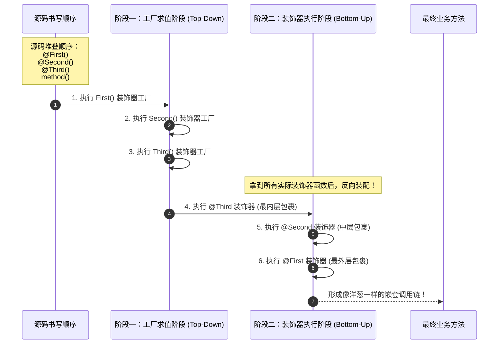

# TypeScript 装饰器全景深度指南：从基础语法到 AOP 核心机制

> **一句话直击本质**：  
> 装饰器（Decorator）是一种特殊的**声明式语法糖**，它本质上是一个**接收目标元数据的高阶函数**。它在**类加载期**对类、方法、属性或参数进行静态元编程与属性劫持，使得我们无需改动业务核心代码，即可从外部为代码注入强大的非侵入式能力。

---

## 1. 宏观全景：装饰器的洋葱执行模型 (Macro-First)

当多个装饰器堆叠在同一个方法上时，TypeScript 严格遵循**“求值自上而下，执行自下而上”**的洋葱模型（函数组合 $f(g(x))$ 逻辑）：



---

## 2. 深入理解 TypeScript 5 大装饰器语法

在 TypeScript 中，装饰器根据所处位置的不同，分为以下 5 种形态：

### ① 类装饰器 (Class Decorator)
- **作用目标**：类的构造函数（Constructor）；
- **函数签名**：`<TFunction extends Function>(target: TFunction) => TFunction | void`；
- **核心能力**：
  - 读取或修改类构造函数；
  - 冻结类原型（`Object.seal` / `Object.freeze`）；
  - 向全局依赖注入容器注册元数据（类似 Spring 的 `@Component`）。
- **实战示例**：参考源码 [`ts-decorator/src/01-class-decorator.ts`](file:///Users/linya/Code/Self/Javascript/ts-decorator/src/01-class-decorator.ts) 中的 `@Sealed` 与 `@Component`。

---

### ② 方法装饰器 (Method Decorator) —— ⭐ AOP 的绝对基石
- **作用目标**：类中的实例方法或静态方法；
- **函数签名**：
  ```typescript
  (target: object, propertyKey: string | symbol, descriptor: PropertyDescriptor) => PropertyDescriptor | void
  ```
- **三个核心形参的真实含义**：
  1. `target`：对于静态成员是类的构造函数，对于实例成员是类的原型对象（`Prototype`）；
  2. `propertyKey`：被修饰的方法名（如 `"getUserById"`）；
  3. `descriptor`：**关键所在！** 目标成员的方法属性描述符。
- **为什么只有方法装饰器能做 AOP？**
  因为只有方法装饰器能拿到 `descriptor.value`（即原方法的函数引用）。通过在闭包中保存原函数，并将 `descriptor.value` 替换为新函数，便轻而易举地实现了切面的**前置拦截、后置处理、耗时统计与异常回滚**！
- **实战示例**：参考源码 [`ts-decorator/src/04-aop-method-decorator.ts`](file:///Users/linya/Code/Self/Javascript/ts-decorator/src/04-aop-method-decorator.ts) 中的 `@Log`、`@MeasureTime`、`@Retry`。

---

### ③ 属性装饰器 (Property Decorator)
- **作用目标**：类的实例属性或静态字段；
- **函数签名**：`(target: object, propertyKey: string | symbol) => void`；
- **核心能力**：
  - 属性装饰器不能返回属性描述符，但可以通过重写原型上的 getter / setter 赋予默认值（`@DefaultValue`）；
  - 收集 ORM 字段元数据（如 TypeORM 的 `@Column()`）；
  - 收集依赖注入注入点（如 `@Inject()`）。
- **实战示例**：参考源码 [`ts-decorator/src/02-property-decorator.ts`](file:///Users/linya/Code/Self/Javascript/ts-decorator/src/02-property-decorator.ts) 中的 `@DefaultValue`。

---

### ④ 访问器装饰器 (Accessor Decorator)
- **作用目标**：类中的 `get` 或 `set` 访问器方法；
- **函数签名**：`(target: object, propertyKey: string | symbol, descriptor: PropertyDescriptor) => PropertyDescriptor | void`；
- **核心能力**：
  - 劫持 getter / setter；
  - 实现昂贵计算结果的实例缓存（`@CacheResult`）；
  - 实现字段修改时的防篡改监听与响应式触发。
- **实战示例**：参考源码 [`ts-decorator/src/02-property-decorator.ts`](file:///Users/linya/Code/Self/Javascript/ts-decorator/src/02-property-decorator.ts) 中的 `@CacheResult`。

---

### ⑤ 参数装饰器 (Parameter Decorator)
- **作用目标**：方法形参列表中的特定参数；
- **函数签名**：`(target: object, propertyKey: string | symbol, parameterIndex: number) => void`；
- **核心能力**：
  - 捕获目标参数在形参列表中的索引下标（0, 1, 2...）；
  - 记录元数据后，由**方法装饰器**协同读取该元数据，在方法进入前进行入参校验（如 `@NotNull`）或参数绑定（如 NestJS 中的 `@Param('id')`、`@Body()`）。
- **实战示例**：参考源码 [`ts-decorator/src/03-parameter-decorator.ts`](file:///Users/linya/Code/Self/Javascript/ts-decorator/src/03-parameter-decorator.ts) 中的 `@NotNull` 与 `@Validate` 组合拳。

---

## 3. ⭐ AOP 重点：装饰器工厂与属性描述符劫持

在 AOP 中，我们几乎总是看到带括号的装饰器（如 `@Log('PAYMENT')`、`@Retry(3, 100)`）。为什么必须写成工厂？

### ① 装饰器工厂的设计原理
如果你需要向装饰器传递配置参数，标准的装饰器签名只允许接收 `(target, key, desc)` 三个固定参数，无法塞入你的自定义参数。
因此，必须使用**高阶函数（Higher-Order Function）**：

```typescript
// 1. 外层函数：装饰器工厂（负责接收开发者的配置参数）
export function Retry(maxAttempts = 3, delayMs = 50): MethodDecorator {
  
  // 2. 内层函数：真正的装饰器（由 TS 运行时调用，接收原生描述符）
  return function (target: object, propertyKey: string | symbol, descriptor: PropertyDescriptor): PropertyDescriptor {
    const originalMethod = descriptor.value; // 借助闭包捕获原方法

    descriptor.value = async function (...args: unknown[]) {
      // 在这里实现重试循环...
    };

    return descriptor;
  };
}
```

### ② 属性描述符劫持的实质
`descriptor` 是 JavaScript ES5 规范中的 `PropertyDescriptor`。
当你执行：
```typescript
const originalMethod = descriptor.value;
descriptor.value = function (this: object, ...args: unknown[]) { ... };
return descriptor;
```
TypeScript 编译器会自动在底层调用：
```javascript
Object.defineProperty(target, propertyKey, descriptor);
```
这就完成了对类原型的无感热替换。

---

## 4. 费曼小学生比喻：给手机贴膜与装手机壳

如果把 TypeScript 的各类装饰器讲给小学生听：

1. **你的裸机（原业务方法）**：
   iPhone 手机本身只会打电话、玩游戏（纯业务逻辑）。
2. **类装饰器（手机型号认证）**：
   在手机盒子上印上防伪标签（`@Component` 元数据），或者把后盖焊死防止私自拆卸（`@Sealed`）。
3. **属性装饰器（出厂壁纸与配件）**：
   手机开机后，如果用户没选壁纸，自动应用预置壁纸（`@DefaultValue` 默认值）。
4. **方法装饰器（⭐ AOP 钢化膜与防摔保护壳）**：
   你的手机打游戏时，最怕摔坏或者进水。
   - 我们给它贴了一层钢化膜（`@Log` 日志切面）；
   - 外面再套一层带散热风扇的防摔壳（`@MeasureTime` 耗时监控）；
   - 如果不小心从桌上掉下去了，防摔气囊自动弹出保护（`@Retry` 自动重试）。
5. **参数装饰器（充电口的防尘塞与防呆接口）**：
   标记只有 Type-C 的正规充电线（`@NotNull`）才能插进去，插错了直接报错拒绝。

你看，手机的核心芯片还是那个芯片，但通过外层的保护壳与配件，它获得了防摔、散热、防尘等全套超能力！

---

## 5. 装饰器执行顺序规则总结

当面对复杂的复合装饰器时，请记住两条铁律：

1. **求值规则（工厂传参阶段）**：
   **从上到下 (Top to Bottom)**。谁写在上面，谁的工厂函数先被求值。
2. **执行规则（方法包裹阶段）**：
   **从下到上 (Bottom to Top)**。越靠近方法的装饰器，越先包裹方法；越写在上面的装饰器，反而包裹在最外层（如同洋葱的最外层表皮）。
3. **不同级别装饰器的整体先后次序**：
   - 参数装饰器先于方法装饰器；
   - 实例方法装饰器先于类装饰器；
   - **类装饰器永远最后压轴执行！**

> 💡 **详细执行时机深度专题**：  
> 想搞清楚装饰器到底何时触发、执行几次、为什么不写 new 也会执行？  
> 请阅读专属专题文档：👉 **[装饰器的执行时机全解：何时执行？执行几次？与 new 的先后关系](./decorator-lifecycle-timing.md)**

---

## 6. 知识内化自检与思考

1. **为什么在 ES2022 下，属性装饰器中的 getter / setter 有时会失效？**  
   （*提示：回顾 TC39 Class Fields 规范，ES2022+ 默认使用 `[[Define]]` 语义初始化实例字段，若未配置 `useDefineForClassFields: false`，实例自身的字段会遮蔽原型上的 getter。*）
2. **在方法装饰器内部，为什么调用原函数必须用 `originalMethod.apply(this, args)` 而不能直接 `originalMethod(...args)`？**  
   （*提示：直接调用会丢失面向对象的实例 `this` 上下文，导致方法内访问 `this.xxx` 变为 `undefined`。*）
3. **TypeScript 5.0 推出的 TC39 Stage 3 装饰器和本项目用的旧版 `experimentalDecorators` 有什么区别？**  
   （*提示：新版无需依赖 `experimentalDecorators` 编译参数，函数签名变为 `(target, context)`，通过 context 上下文对象管理元数据，标准更加现代化。但在企业级生态如 NestJS、Angular 中，经典装饰器依然是事实上的主流。*）
