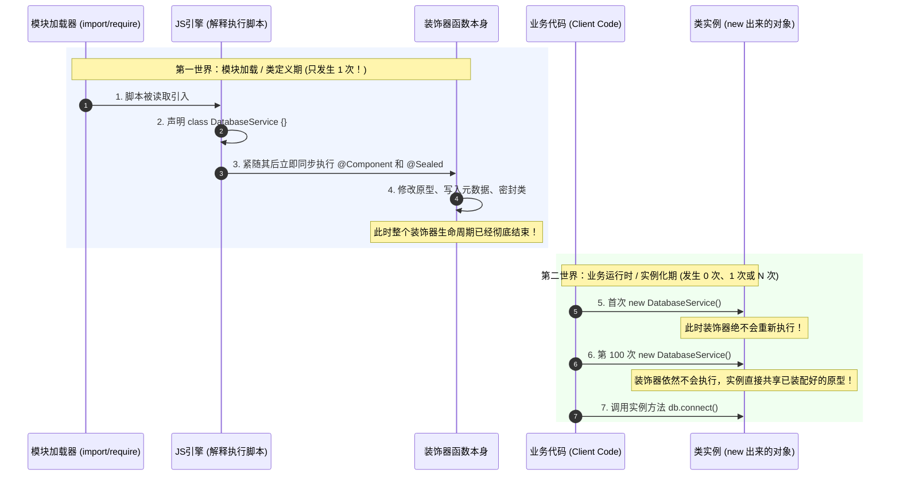

# 装饰器的执行时机全解：何时执行？执行几次？与 new 的先后关系

> **一句话直击核心结论**：  
> **装饰器【不是】在 `new Class()` 实例化时执行的，更【不是】在调用方法时才执行的！**  
> 装饰器是在 **【类被 JavaScript 引擎首次加载/定义时（Class Definition Time），立即同步执行，且全局只执行一次】**！  
> 哪怕你的代码里**从头到尾一次都没有 `new` 过这个类**，只要包含该类的文件被 `import` 或 `require` 引入，装饰器就已经**全部执行完毕**了。

---

## 1. 宏观全景：两个世界的时空鸿沟 (Macro-First)

很多初学者容易将“类定义”与“对象实例化”混为一谈。在现代 JavaScript / TypeScript 运行时中，它们属于两个完全不同的时空阶段：



---

## 2. 底层真相剖析：为什么说是在“类定义时”？

让我们直接还原下面这段看似神秘的装饰器代码：

```typescript
@Component({
  id: "databaseService",
  scope: "SINGLETON",
  description: "全局单例数据库连接服务",
})
@Sealed
export class DatabaseService {
  public connect() {
    return 'connected';
  }
}
```

### 查看 TypeScript 编译后的纯 JavaScript 真相
打开 `dist/01-class-decorator.js`，你会看到没有丝毫魔法的底层代码：

```javascript
// 1. JS 引擎首先解释执行 class 语句，在内存中生成构造函数
class DatabaseService {
    connect() {
        return 'connected';
    }
}
exports.DatabaseService = DatabaseService;

// 2. ⭐⭐⭐ 紧随 class 语句之后，立即同步调用了这一行：
__decorate([
    Component({
        id: "databaseService",
        scope: "SINGLETON",
        description: "全局单例数据库连接服务",
    }),
    Sealed
], DatabaseService);

// 3. 后续没有任何代码，也没有 new DatabaseService()！
```

### 事实一目了然：
1. `__decorate(...)` 是紧跟在 `class` 语句后面的一行**普通的同步函数调用**；
2. 当 Node.js 或浏览器解析执行到这个 JS 模块时，读完 `class` 之后**立刻、原地**执行了 `__decorate`；
3. 执行时，`@Sealed` 立即把 `DatabaseService.prototype` 密封；`@Component` 立即把元数据写入全局注册表；
4. **这一切发生时，世界上甚至还没有任何一个 `DatabaseService` 的实例对象存在！**

---

## 3. 费曼小学生比喻：大厦落成验收 vs 租客搬家入住

如果向一个小学生解释这个执行时机：

* 🏗️ **类定义加载期（装饰器执行的瞬间）**：  
  就像**开发商盖好了一座全新写字楼（类）**。  
  在竣工验收的那一天（模块加载时）：  
  - 工人们在大楼外墙挂上“XX科技大厦”的金属招牌（这就是 `@Component` 录入元数据）；  
  - 工人们把配电房的大门加装铁锁焊死（这就是 `@Sealed` 密封原型）。  
  **这些事情在大楼建好交房的那一刻，一次性全部完成！**
* 🚶 **实例化 `new DatabaseService()`**：  
  就像**租客租下大楼里的办公室搬家入住**。  
  不管今天搬进来 1 个租客，还是明天搬进来 100 个租客，外墙的招牌和配电房的锁**早就已经装好了**，绝不需要每搬进来一个租客，就把整座大楼重新挂牌翻新一次！

---

## 4. 重点解惑：AOP 方法装饰器的“两阶段时机分离”

这是初学者最容易产生混淆的问题：  
> *“既然装饰器只在类定义时执行一次，那我的 AOP `@Log` 或 `@MeasureTime` 是怎么做到每次调用方法时都打印日志和耗时的呢？”*

### 核心答案：方法装饰器是严格的“两阶段执行”！

```text
【第一阶段：类定义期 (只执行 1 次)】
    代码被引入，@Log 装饰器函数执行。
    它的任务仅仅是：把原方法取出来放进闭包，把原方法替换为一个全新的“包装函数 (Wrapper)”。
    这个“偷梁换柱”的替换动作，全局只发生这 1 次！
         ↓
【第二阶段：业务运行时 (调用多少次就执行多少次)】
    外部调用 service.getUserById('1001')。
    此时触发的，正是第一阶段早就替换上去的“包装函数”！
    包装函数负责打印前置日志、记录时间戳、调用原方法、打印后置日志。
```

> **手机贴膜比喻**：  
> - **贴防刮钢化膜（方法装饰器本身）**：手机买回来的第一天贴一次（类定义期只做 1 次）；  
> - **手指点击屏幕（切面拦截执行）**：以后无论你玩多少次手机（调用多少次方法），每次手指点下去，都是隔着这层钢化膜在响应！

---

## 5. 微观时序规则：类内部各类装饰器的“四步法则”

在类被加载定义的那一瞬间，如果一个类内部同时存在多种装饰器，TypeScript 规定了严格的微观执行次序：

```text
1. 实例成员就位 (Instance Members)
   └─ 规则：先执行参数装饰器，再执行方法 / 属性 / 访问器装饰器
2. 静态成员就位 (Static Members)
   └─ 规则：先执行参数装饰器，再执行方法 / 属性 / 访问器装饰器
3. 构造函数参数就位 (Constructor Parameters)
   └─ 规则：执行构造函数上的参数装饰器
4. 类本身压轴就位 (Class Decorators)
   └─ 规则：类装饰器永远最后压轴执行！
```

### 为什么类装饰器必须最后执行？
因为盖大楼必须先把里边的门窗水电（方法、属性、形参）全部安装调试完毕，确认无误后，最后才能在大楼正门挂上竣工验收合格的铭牌（类装饰器）。

---

## 6. 3 行极简代码自查实验

你可以新建一个空白的 `test.ts` 文件，亲自见证这一时序事实：

```typescript
function LogTiming(target: any) {
  console.log('>>> [证明] 装饰器执行了！当前时间戳:', Date.now());
}

@LogTiming
class MyTestClass {}

// 注意：这里没有任何 new MyTestClass()，也没有任何方法调用！
```

运行编译执行：
```bash
npx ts-node test.ts
```
**控制台将瞬间输出**：
```text
>>> [证明] 装饰器执行了！当前时间戳: 1790127246882
```
这彻底证明了：**它的触发时机就是脚本被解释加载、类被定义的瞬间，与 `new` 完全无关！**

---

## 7. 总结记忆卡片

| 疑问 | 准确答案 |
| :--- | :--- |
| **装饰器何时执行？** | 类被引擎加载定义时（Class Definition Time），立即同步执行。 |
| **执行多少次？** | 全生命周期中**只执行 1 次**。 |
| **与 `new` 的关系？** | 在任何 `new` 发生之前就已经执行完毕；`new` 多少次都不会重复执行装饰器。 |
| **AOP 方法切面为什么能每次生效？** | 装饰器只执行 1 次完成“方法包装替换”；后续调用的是替换后的包装函数。 |
